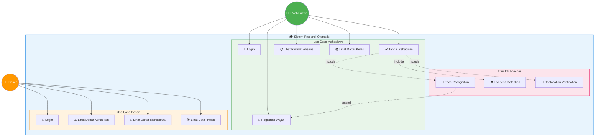
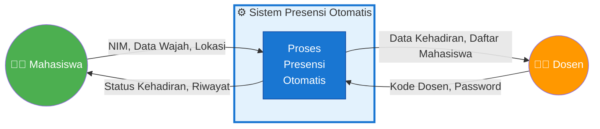
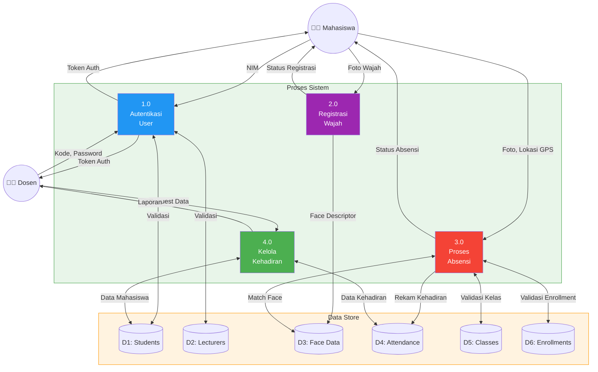
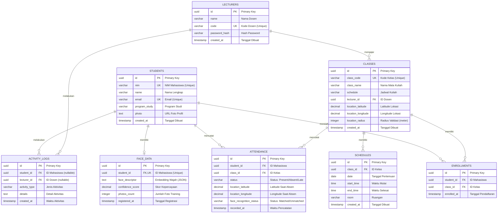
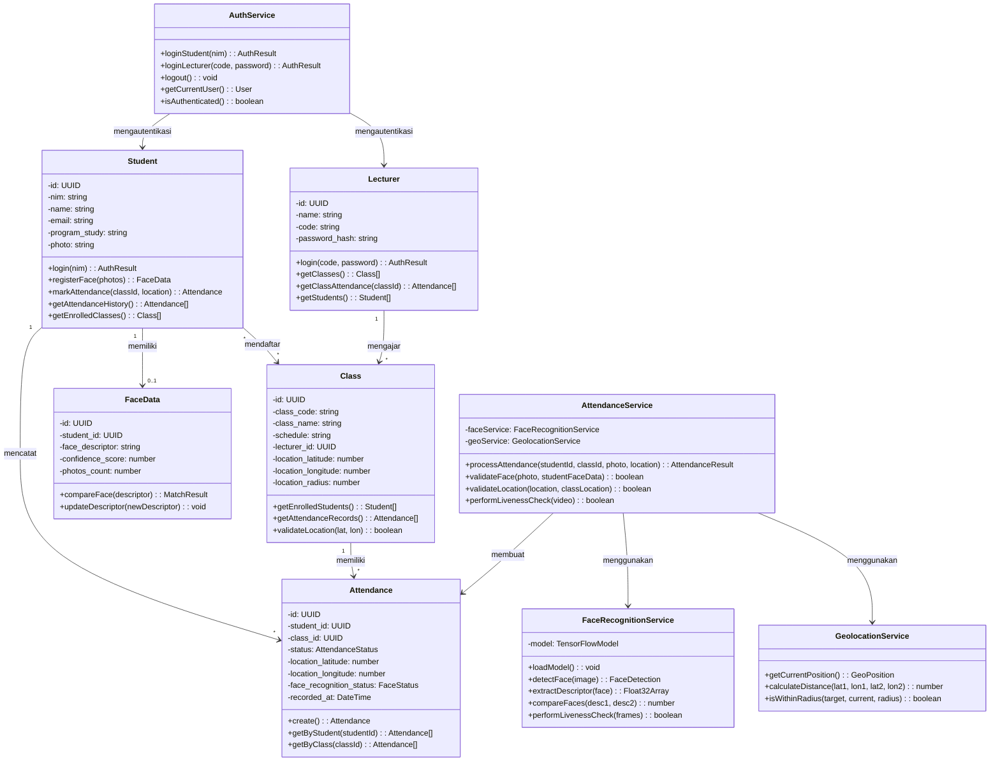
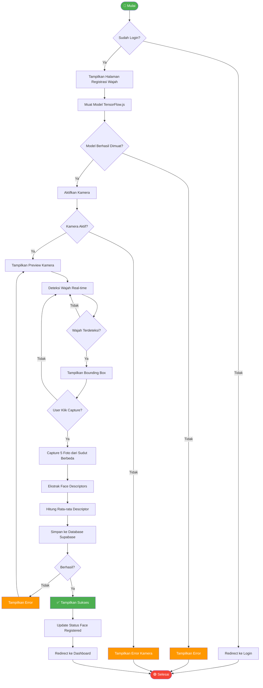
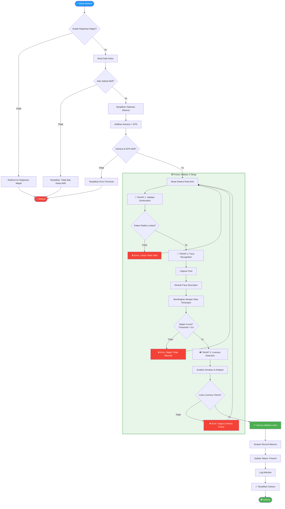
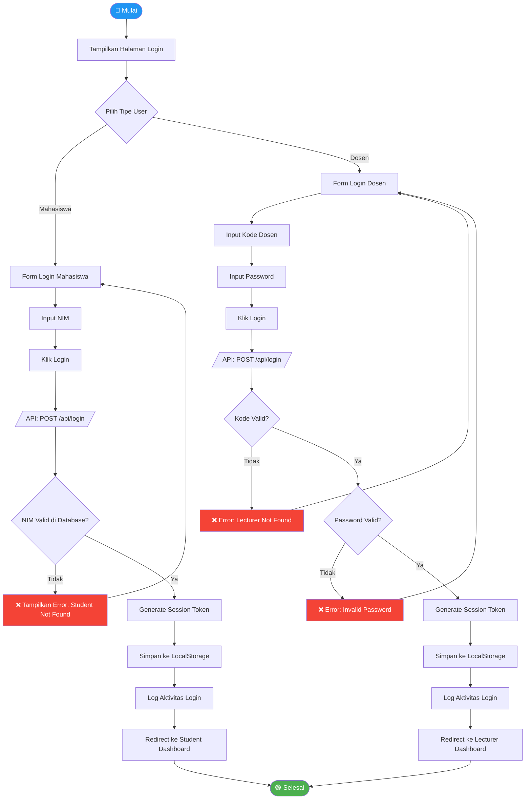

# Diagram Sistem Presensi Otomatis

**Aplikasi:** Sistem Presensi Otomatis Mahasiswa Menggunakan Face Recognition dan Geolocation Berbasis Web

---

## 1. Use Case Diagram

### Deskripsi Use Case

| ID  | Use Case               | Aktor     | Deskripsi                                                       |
| --- | ---------------------- | --------- | --------------------------------------------------------------- |
| UC1 | Login Mahasiswa        | Mahasiswa | Mahasiswa login menggunakan NIM                                 |
| UC2 | Registrasi Wajah       | Mahasiswa | Capture dan simpan data embedding wajah                         |
| UC3 | Tandai Kehadiran       | Mahasiswa | Proses absensi dengan Face Recognition + Liveness + Geolocation |
| UC4 | Lihat Riwayat Absensi  | Mahasiswa | Melihat catatan kehadiran                                       |
| UC5 | Lihat Daftar Kelas     | Mahasiswa | Melihat kelas yang diikuti                                      |
| UC6 | Login Dosen            | Dosen     | Dosen login dengan kode dan password                            |
| UC7 | Lihat Daftar Kehadiran | Dosen     | Melihat rekap kehadiran mahasiswa                               |
| UC8 | Lihat Daftar Mahasiswa | Dosen     | Melihat mahasiswa yang terdaftar                                |
| UC9 | Lihat Detail Kelas     | Dosen     | Melihat informasi detail kelas                                  |

---

## 2. Data Flow Diagram (DFD)

### DFD Level 0 (Context Diagram)

### DFD Level 1

---

## 3. Entity Relationship Diagram (ERD)

### Kamus Data (Data Dictionary)

#### Tabel: STUDENTS

| Kolom         | Tipe Data    | Constraint       | Deskripsi                 |
| ------------- | ------------ | ---------------- | ------------------------- |
| id            | UUID         | PK, NOT NULL     | Identifier unik mahasiswa |
| nim           | VARCHAR(20)  | UNIQUE, NOT NULL | Nomor Induk Mahasiswa     |
| name          | VARCHAR(100) | NOT NULL         | Nama lengkap mahasiswa    |
| email         | VARCHAR(100) | UNIQUE, NOT NULL | Alamat email              |
| program_study | VARCHAR(100) | NOT NULL         | Program studi             |
| photo         | TEXT         | NULL             | URL foto profil           |
| created_at    | TIMESTAMP    | DEFAULT NOW()    | Waktu pembuatan record    |

#### Tabel: LECTURERS

| Kolom         | Tipe Data    | Constraint       | Deskripsi                 |
| ------------- | ------------ | ---------------- | ------------------------- |
| id            | UUID         | PK, NOT NULL     | Identifier unik dosen     |
| name          | VARCHAR(100) | NOT NULL         | Nama lengkap dosen        |
| code          | VARCHAR(20)  | UNIQUE, NOT NULL | Kode identifikasi dosen   |
| password_hash | VARCHAR(255) | NOT NULL         | Hash password untuk login |
| created_at    | TIMESTAMP    | DEFAULT NOW()    | Waktu pembuatan record    |

#### Tabel: CLASSES

| Kolom              | Tipe Data     | Constraint        | Deskripsi                   |
| ------------------ | ------------- | ----------------- | --------------------------- |
| id                 | UUID          | PK, NOT NULL      | Identifier unik kelas       |
| class_code         | VARCHAR(20)   | UNIQUE, NOT NULL  | Kode kelas                  |
| class_name         | VARCHAR(100)  | NOT NULL          | Nama mata kuliah            |
| schedule           | VARCHAR(100)  | NOT NULL          | Jadwal perkuliahan          |
| lecturer_id        | UUID          | FK → lecturers.id | Referensi ke dosen pengajar |
| location_latitude  | DECIMAL(10,8) | NOT NULL          | Latitude lokasi kelas       |
| location_longitude | DECIMAL(11,8) | NOT NULL          | Longitude lokasi kelas      |
| location_radius    | INTEGER       | DEFAULT 50        | Radius validasi dalam meter |
| created_at         | TIMESTAMP     | DEFAULT NOW()     | Waktu pembuatan record      |

#### Tabel: FACE_DATA

| Kolom            | Tipe Data    | Constraint    | Deskripsi                        |
| ---------------- | ------------ | ------------- | -------------------------------- |
| id               | UUID         | PK, NOT NULL  | Identifier unik                  |
| student_id       | UUID         | FK, UNIQUE    | Referensi ke mahasiswa           |
| face_descriptor  | TEXT         | NOT NULL      | Face embedding dalam format JSON |
| confidence_score | DECIMAL(4,3) | DEFAULT 0.95  | Skor confidence minimum          |
| photos_count     | INTEGER      | DEFAULT 5     | Jumlah foto yang digunakan       |
| registered_at    | TIMESTAMP    | DEFAULT NOW() | Waktu registrasi wajah           |

#### Tabel: ATTENDANCE

| Kolom                   | Tipe Data     | Constraint                        | Deskripsi              |
| ----------------------- | ------------- | --------------------------------- | ---------------------- |
| id                      | UUID          | PK, NOT NULL                      | Identifier unik        |
| student_id              | UUID          | FK → students.id                  | Referensi ke mahasiswa |
| class_id                | UUID          | FK → classes.id                   | Referensi ke kelas     |
| status                  | VARCHAR(20)   | CHECK (Present/Absent/Late)       | Status kehadiran       |
| location_latitude       | DECIMAL(10,8) | NULL                              | Latitude saat absensi  |
| location_longitude      | DECIMAL(11,8) | NULL                              | Longitude saat absensi |
| face_recognition_status | VARCHAR(20)   | CHECK (Matched/Unmatched/Pending) | Hasil face recognition |
| recorded_at             | TIMESTAMP     | DEFAULT NOW()                     | Waktu pencatatan       |

#### Tabel: ENROLLMENTS

| Kolom       | Tipe Data | Constraint                   | Deskripsi                          |
| ----------- | --------- | ---------------------------- | ---------------------------------- |
| id          | UUID      | PK, NOT NULL                 | Identifier unik pendaftaran        |
| student_id  | UUID      | FK → students.id, NOT NULL   | Referensi ke mahasiswa             |
| class_id    | UUID      | FK → classes.id, NOT NULL    | Referensi ke kelas                 |
| enrolled_at | TIMESTAMP | DEFAULT NOW()                | Waktu pendaftaran                  |
|             |           | UNIQUE(student_id, class_id) | Kombinasi unik mahasiswa dan kelas |

#### Tabel: SCHEDULES

| Kolom      | Tipe Data   | Constraint      | Deskripsi                 |
| ---------- | ----------- | --------------- | ------------------------- |
| id         | UUID        | PK, NOT NULL    | Identifier unik jadwal    |
| class_id   | UUID        | FK → classes.id | Referensi ke kelas        |
| date       | DATE        | NOT NULL        | Tanggal pertemuan         |
| start_time | TIME        | NOT NULL        | Waktu mulai perkuliahan   |
| end_time   | TIME        | NOT NULL        | Waktu selesai perkuliahan |
| room       | VARCHAR(50) | NULL            | Nama/kode ruangan         |
| created_at | TIMESTAMP   | DEFAULT NOW()   | Waktu pembuatan record    |

#### Tabel: ACTIVITY_LOGS

| Kolom         | Tipe Data   | Constraint              | Deskripsi                                  |
| ------------- | ----------- | ----------------------- | ------------------------------------------ |
| id            | UUID        | PK, NOT NULL            | Identifier unik log aktivitas              |
| student_id    | UUID        | FK → students.id, NULL  | Referensi ke mahasiswa (nullable)          |
| lecturer_id   | UUID        | FK → lecturers.id, NULL | Referensi ke dosen (nullable)              |
| activity_type | VARCHAR(50) | NOT NULL                | Jenis aktivitas (Login, Attendance, dll)   |
| details       | TEXT        | NULL                    | Detail tambahan aktivitas dalam teks bebas |
| created_at    | TIMESTAMP   | DEFAULT NOW()           | Waktu aktivitas dicatat                    |

**Nilai activity_type yang Digunakan:**
| Nilai | Deskripsi |
|-------|-----------|
| `Login` | User berhasil login ke sistem |
| `FaceRegistration` | Mahasiswa mendaftarkan wajah |
| `Attendance` | Mahasiswa melakukan absensi |
| `Logout` | User keluar dari sistem |

---

## 4. Class Diagram

---

## 5. Flowchart

### 5.1 Flowchart Registrasi Wajah

### 5.2 Flowchart Proses Absensi (Core Feature)

### 5.3 Flowchart Login System

---

## Ringkasan Fitur Inti

| Komponen               | Teknologi                     | Fungsi                                          |
| ---------------------- | ----------------------------- | ----------------------------------------------- |
| **Face Recognition**   | TensorFlow.js + face-api.js   | Mengenali identitas mahasiswa dari wajah        |
| **Liveness Detection** | TensorFlow.js BlazeFace       | Mendeteksi apakah wajah asli (bukan foto/video) |
| **Geolocation**        | Browser Geolocation API       | Memvalidasi lokasi mahasiswa dalam radius kelas |
| **Database**           | Supabase (PostgreSQL)         | Menyimpan semua data aplikasi                   |
| **Frontend**           | Next.js + React + TailwindCSS | User interface responsif                        |

---

> **Catatan:** Semua diagram menggunakan sintaks Mermaid yang kompatibel dengan GitHub, GitLab, dan sebagian besar platform dokumentasi modern.
