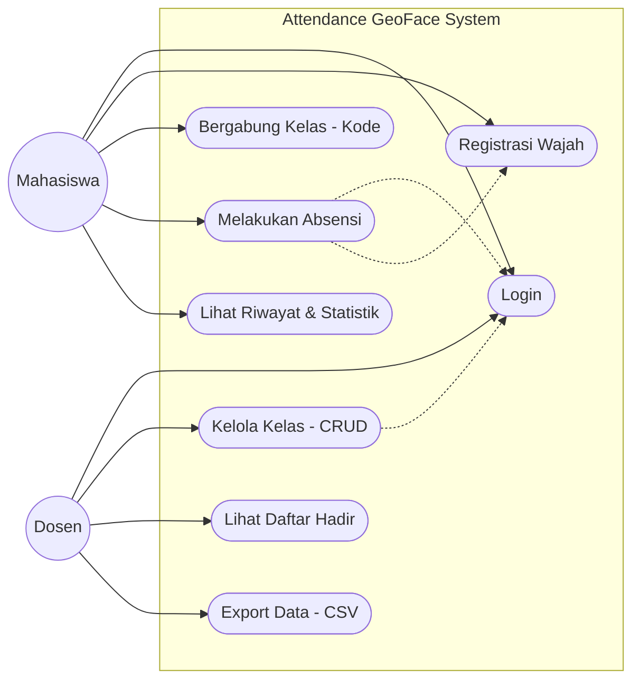
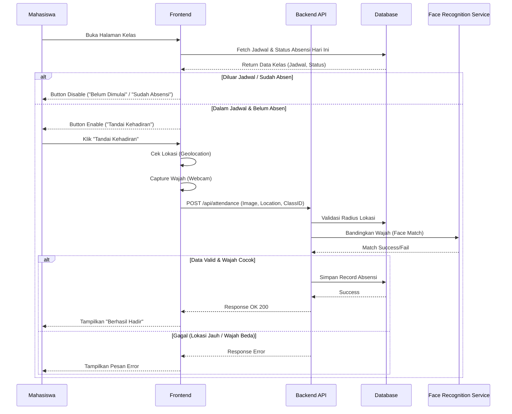
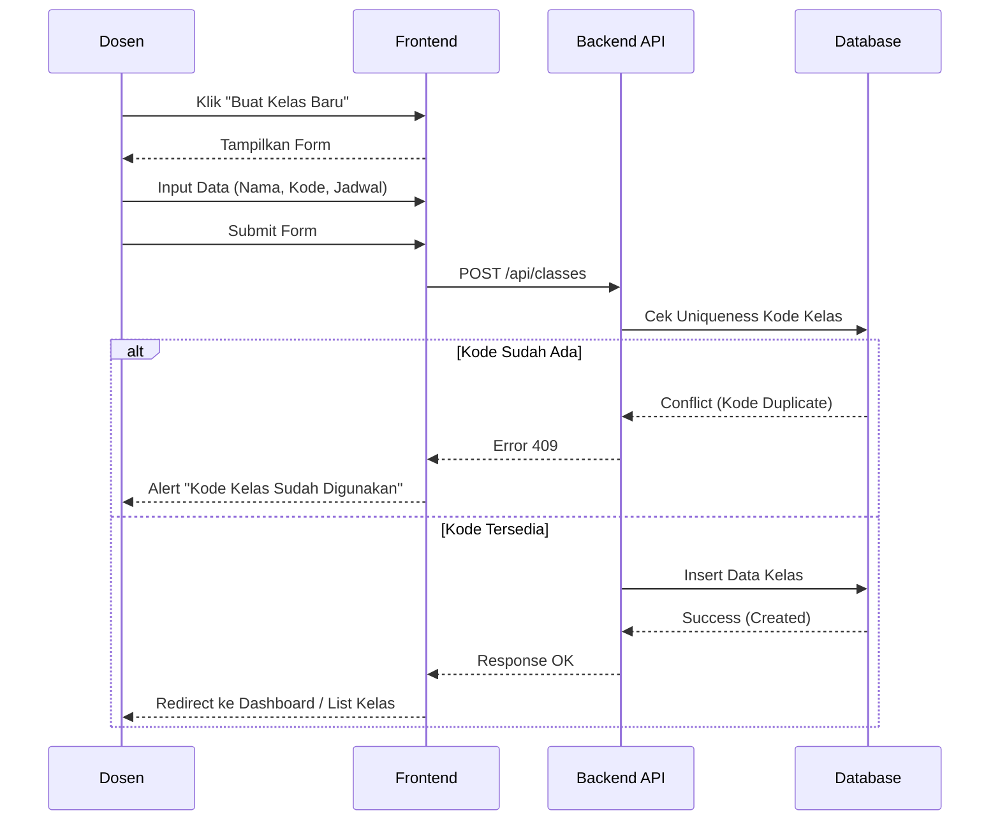
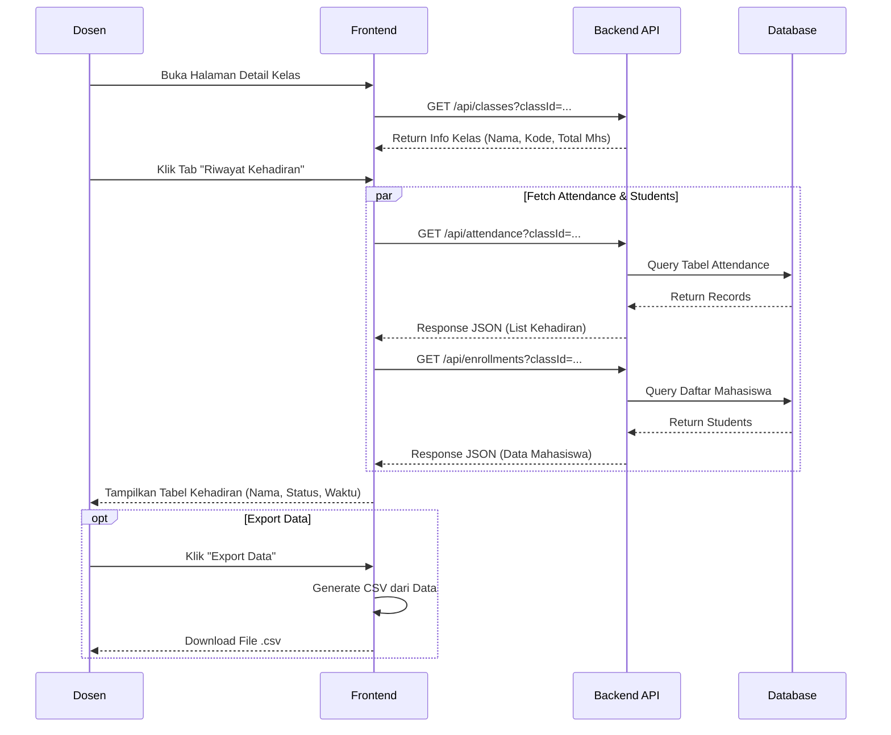

# System Diagrams - Attendance GeoFace

Dokumen ini berisi diagram pemodelan sistem untuk aplikasi Attendance GeoFace, yang mencakup Use Case Diagram dan Sequence Diagram.

## 1. Use Case Diagram

Use Case diagram menggambarkan interaksi antara pengguna (aktor) dengan sistem.

### Penjelasan Use Case

#### Aktor: Mahasiswa

1.  **Login**: Mahasiswa masuk ke dashboard menggunakan kredensial (NIM/Email).
2.  **Registrasi Wajah**: Mahasiswa mendaftarkan data biometrik wajah mereka menggunakan webcam sebagai syarat utama sebelum bisa melakukan absensi.
3.  **Bergabung Kelas**: Mahasiswa bergabung ke kelas mata kuliah menggunakan "Kode Kelas" unik yang diberikan dosen.
4.  **Melakukan Absensi**: Proses inti di mana mahasiswa menandai kehadiran. Sistem akan memvalidasi:
    - Waktu (Apakah sesuai jadwal?)
    - Lokasi (Apakah berada dalam radius kampus?)
    - Wajah (Apakah wajah cocok dengan data registrasi?)
    - Duplikasi (Apakah sudah absen hari ini?)
5.  **Lihat Riwayat & Statistik**: Mahasiswa melihat daftar kelas, persentase kehadiran, dan status pertemuan.

#### Aktor: Dosen

1.  **Login**: Dosen masuk menggunakan NIP/Kode Dosen.
2.  **Kelola Kelas**: Dosen dapat membuat kelas baru, mengatur jadwal, dan mengedit informasi kelas.
3.  **Lihat Daftar Hadir**: Dosen memantau siapa saja yang hadir, terlambat, atau alpa pada setiap pertemuan.
4.  **Export Data**: Dosen mengunduh laporan kehadiran dan data mahasiswa dalam format CSV/Excel.

---

## 2. Sequence Diagram

Sequence diagram menggambarkan urutan interaksi antar objek/komponen dalam sistem untuk skenario tertentu.

### 2.1 Sequence Diagram: Proses Absensi Mahasiswa

Diagram ini menunjukkan alur ketika mahasiswa melakukan absensi.

### Penjelasan Sequence Absensi

1.  Saat mahasiswa membuka halaman, sistem langsung memeriksa **Jadwal** dan **Status Absensi Harian**. Jika tidak valid, tombol di-disable.
2.  Jika valid, mahasiswa mengklik tombol. Frontend mengambil lokasi GPS dan foto wajah.
3.  Data dikirim ke Backend. Backend melakukan verifikasi bertingkat: Radius Lokasi -> Pencocokan Wajah.
4.  Jika semua valid, data disimpan ke database dan status kehadiran mahasiswa tercatat.

---

### 2.2 Sequence Diagram: Pembuatan Kelas Baru (Dosen)

Diagram ini menunjukkan alur dosen membuat kelas baru.

### Penjelasan Sequence Buat Kelas

1.  Dosen mengisi form pembuatan kelas.
2.  Sistem melakukan validasi **Uniqueness** pada Kode Kelas untuk mencegah duplikasi.
3.  Jika kode unik, kelas dibuat dan dosen diarahkan kembali ke dashboard.

---

### 2.3 Sequence Diagram: Cek Kehadiran (Dosen)

Diagram ini menunjukkan alur dosen melihat riwayat kehadiran mahasiswa di suatu kelas.

### Penjelasan Sequence Cek Kehadiran

1.  Dosen membuka detail kelas. Aplikasi memuat informasi dasar kelas.
2.  Saat dosen mengakses tab "Riwayat Kehadiran", sistem mengambil data absensi dan data mahasiswa secara paralel.
3.  Data digabungkan dan ditampilkan dalam bentuk tabel yang memudahkan monitoring.
4.  (Opsional) Dosen dapat mengunduh data tersebut sebagai file CSV.
